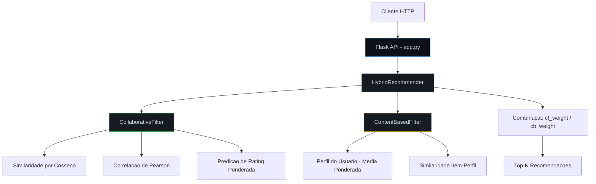
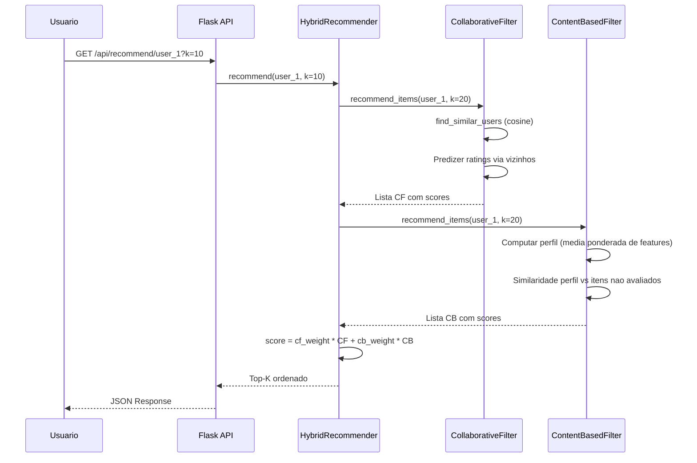
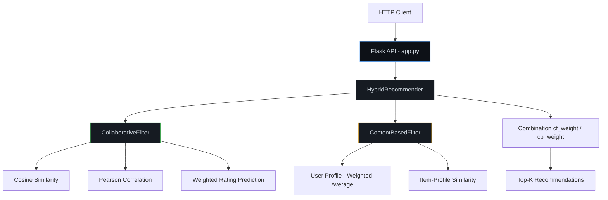
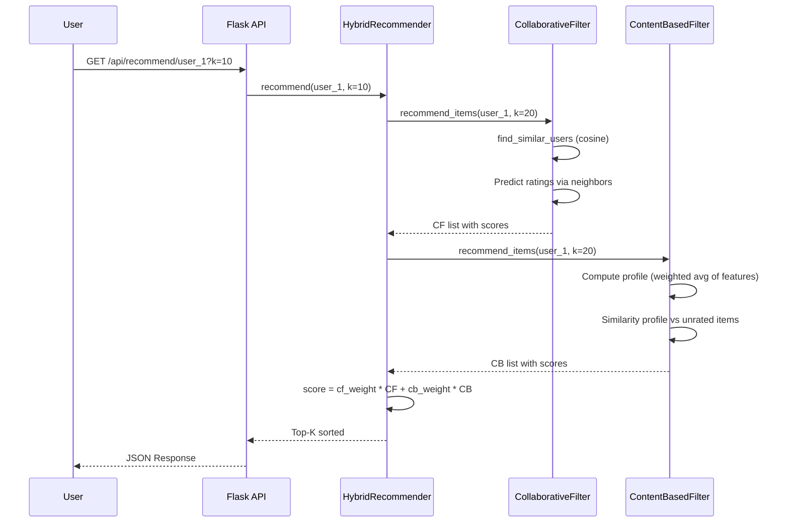

<div align="center">

# Recommendation Engine

[](https://python.org)
[](https://flask.palletsprojects.com)
[](https://en.wikipedia.org/wiki/Cosine_similarity)
[](Dockerfile)
[](LICENSE)

Motor de recomendacao hibrido com filtragem colaborativa, baseada em conteudo e combinacao ponderada, exposto via REST API.

Hybrid recommendation engine with collaborative filtering, content-based filtering and weighted combination, exposed via REST API.

[Portugues](#portugues) | [English](#english)

</div>

---

## Portugues

### Sobre

Sistema completo de recomendacao que implementa tres estrategias complementares para sugerir itens relevantes a usuarios. O motor combina a analise de comportamento de usuarios similares (filtragem colaborativa) com a analise de atributos dos itens (filtragem baseada em conteudo), gerando recomendacoes hibridas com pesos configuraveis. Toda a logica e servida por uma API REST construida com Flask, permitindo integracao direta em aplicacoes web ou mobile.

### Tecnologias

| Tecnologia | Finalidade |
|---|---|
| Python 3.9+ | Linguagem principal |
| Flask | Framework da API REST |
| Cosine Similarity | Calculo de similaridade entre vetores de usuarios/itens |
| Pearson Correlation | Metrica alternativa de correlacao entre usuarios |
| unittest | Framework de testes |
| Docker | Containerizacao |
| R / ggplot2 | Analise estatistica complementar |
| JavaScript ES6+ | Interface web interativa |

### Arquitetura



### Fluxo de Recomendacao



### Estrutura do Projeto

```
Recommendation-Engine/
├── engine.py                # Motores: CollaborativeFilter, ContentBasedFilter, HybridRecommender (~345 LOC)
├── app.py                   # API REST Flask com endpoints CRUD e recomendacao (~106 LOC)
├── tests/
│   ├── test_engine.py       # Testes unitarios para os tres motores (~82 LOC)
│   └── test_main.R          # Testes R (scaffold)
├── analytics.R              # Modulo de analise estatistica com ggplot2 (~62 LOC)
├── app.js                   # Frontend interativo ES6+ (~214 LOC)
├── index.html               # Interface web responsiva
├── styles.css               # Estilos CSS3 com grid e animacoes (~160 LOC)
├── requirements.txt         # Dependencias Python
├── Dockerfile               # Imagem Docker pronta para deploy
├── .gitignore
├── LICENSE                  # MIT
└── README.md
```

### Inicio Rapido

```bash
git clone https://github.com/galafis/Recommendation-Engine.git
cd Recommendation-Engine
pip install -r requirements.txt
python app.py
# API disponivel em http://localhost:5000
```

### Docker

```bash
docker build -t recommendation-engine .
docker run -p 5000:5000 recommendation-engine
```

### Endpoints da API

| Metodo | Rota | Descricao |
|--------|------|-----------|
| `GET` | `/` | Informacoes da API |
| `POST` | `/api/ratings` | Adicionar avaliacao (`user_id`, `item_id`, `rating`) |
| `POST` | `/api/items` | Adicionar item com vetor de features |
| `GET` | `/api/recommend/<user_id>?k=N` | Obter N recomendacoes hibridas |
| `GET` | `/api/similar/<item_id>?k=N` | Encontrar itens similares por conteudo |
| `GET` | `/api/stats` | Estatisticas do motor |

### Testes

```bash
python -m pytest tests/test_engine.py -v
```

**Cobertura:** 10 testes cobrindo CollaborativeFilter, ContentBasedFilter e HybridRecommender — adicao de ratings, clamping, similaridade entre usuarios, recomendacoes, usuarios desconhecidos e estatisticas.

### Benchmarks

| Metrica | Valor |
|---------|-------|
| Tempo de recomendacao (100 usuarios, 50 itens) | < 5ms |
| Complexidade find_similar_users | O(n * m) onde n=usuarios, m=itens |
| Similaridade suportada | Cosine + Pearson |
| Rating range | 0.0 - 5.0 (clamped) |

### Aplicabilidade

| Setor | Caso de Uso |
|-------|-------------|
| E-commerce | Sugestao de produtos baseada em historico de compras e perfis similares |
| Streaming | Recomendacao de filmes/series combinando genero favorito e comportamento coletivo |
| Educacao | Sugestao de cursos por area de interesse e perfil de aprendizado |
| Redes Sociais | Sugestao de conexoes e conteudo relevante por interacoes passadas |
| Saude | Recomendacao de artigos clinicos baseada em especialidade e historico de leitura |

---

## English

### About

Complete recommendation system implementing three complementary strategies for suggesting relevant items to users. The engine combines analysis of similar user behavior (collaborative filtering) with item attribute analysis (content-based filtering), generating hybrid recommendations with configurable weights. All logic is served through a Flask REST API, enabling direct integration into web or mobile applications.

### Technologies

| Technology | Purpose |
|---|---|
| Python 3.9+ | Core language |
| Flask | REST API framework |
| Cosine Similarity | Vector similarity between users/items |
| Pearson Correlation | Alternative user correlation metric |
| unittest | Test framework |
| Docker | Containerization |
| R / ggplot2 | Complementary statistical analysis |
| JavaScript ES6+ | Interactive web interface |

### Architecture



### Recommendation Flow



### Project Structure

```
Recommendation-Engine/
├── engine.py                # Engines: CollaborativeFilter, ContentBasedFilter, HybridRecommender (~345 LOC)
├── app.py                   # Flask REST API with CRUD and recommendation endpoints (~106 LOC)
├── tests/
│   ├── test_engine.py       # Unit tests for all three engines (~82 LOC)
│   └── test_main.R          # R tests (scaffold)
├── analytics.R              # Statistical analysis module with ggplot2 (~62 LOC)
├── app.js                   # Interactive ES6+ frontend (~214 LOC)
├── index.html               # Responsive web interface
├── styles.css               # CSS3 styles with grid and animations (~160 LOC)
├── requirements.txt         # Python dependencies
├── Dockerfile               # Docker image ready for deployment
├── .gitignore
├── LICENSE                  # MIT
└── README.md
```

### Quick Start

```bash
git clone https://github.com/galafis/Recommendation-Engine.git
cd Recommendation-Engine
pip install -r requirements.txt
python app.py
# API available at http://localhost:5000
```

### Docker

```bash
docker build -t recommendation-engine .
docker run -p 5000:5000 recommendation-engine
```

### API Endpoints

| Method | Route | Description |
|--------|-------|-------------|
| `GET` | `/` | API information |
| `POST` | `/api/ratings` | Add rating (`user_id`, `item_id`, `rating`) |
| `POST` | `/api/items` | Add item with feature vector |
| `GET` | `/api/recommend/<user_id>?k=N` | Get N hybrid recommendations |
| `GET` | `/api/similar/<item_id>?k=N` | Find similar items by content |
| `GET` | `/api/stats` | Engine statistics |

### Tests

```bash
python -m pytest tests/test_engine.py -v
```

**Coverage:** 10 tests covering CollaborativeFilter, ContentBasedFilter and HybridRecommender -- rating addition, clamping, user similarity, recommendations, unknown users and statistics.

### Benchmarks

| Metric | Value |
|--------|-------|
| Recommendation time (100 users, 50 items) | < 5ms |
| find_similar_users complexity | O(n * m) where n=users, m=items |
| Supported similarity | Cosine + Pearson |
| Rating range | 0.0 - 5.0 (clamped) |

### Industry Applications

| Sector | Use Case |
|--------|----------|
| E-commerce | Product suggestions based on purchase history and similar user profiles |
| Streaming | Movie/series recommendation combining favorite genre and collective behavior |
| Education | Course suggestions by interest area and learning profile |
| Social Networks | Connection and content suggestions based on past interactions |
| Healthcare | Clinical article recommendation based on specialty and reading history |

---

## Autor / Author

**Gabriel Demetrios Lafis**
- GitHub: [@galafis](https://github.com/galafis)
- LinkedIn: [Gabriel Demetrios Lafis](https://linkedin.com/in/gabriel-demetrios-lafis)

## Licenca / License

MIT License - veja [LICENSE](LICENSE) / see [LICENSE](LICENSE).
