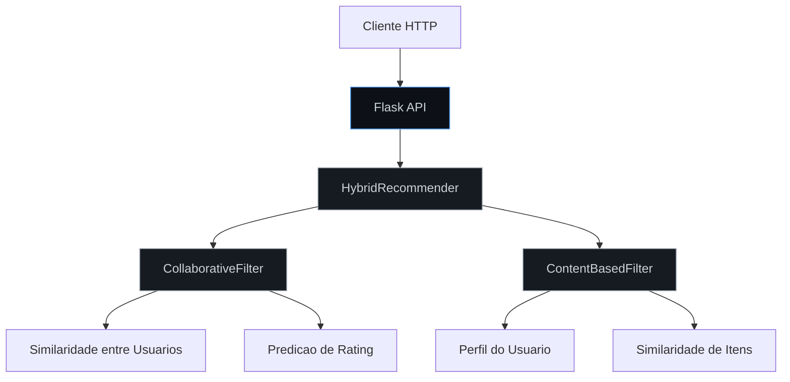
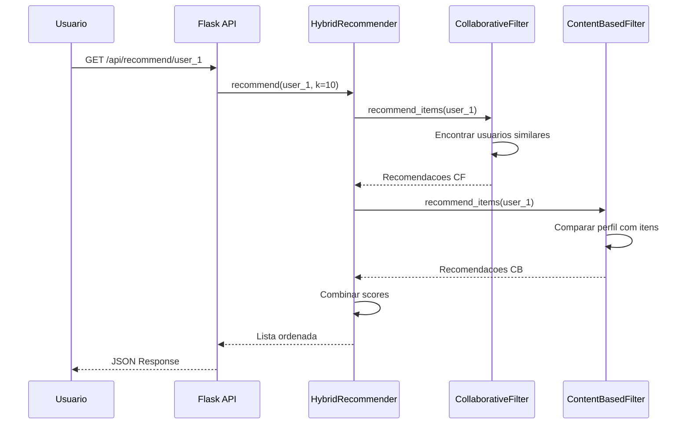
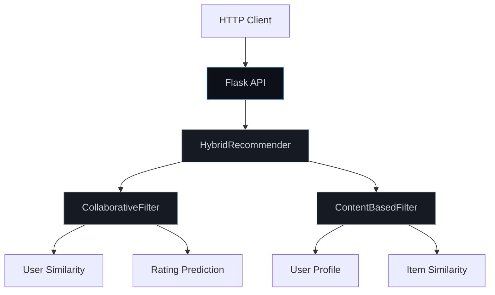

# Recommendation Engine

Motor de recomendacao com filtragem colaborativa, baseada em conteudo e hibrida.

Recommendation engine with collaborative, content-based, and hybrid filtering.

[](https://python.org)
[](https://flask.palletsprojects.com)
[](LICENSE)
[](Dockerfile)

[Portugues](#portugues) | [English](#english)

---

## Portugues

### Visao Geral

Sistema de recomendacao que implementa tres abordagens:

- **Filtragem Colaborativa**: Recomenda itens com base na similaridade entre usuarios (cosseno e Pearson).
- **Filtragem Baseada em Conteudo**: Recomenda itens similares aos que o usuario ja avaliou positivamente, utilizando vetores de caracteristicas.
- **Recomendacao Hibrida**: Combina ambas as abordagens com pesos configuraveis.

### Arquitetura



### Fluxo de Recomendacao



### Inicio Rapido

```bash
git clone https://github.com/galafis/Recommendation-Engine.git
cd Recommendation-Engine
pip install -r requirements.txt
python app.py
```

### Endpoints

| Metodo | Rota | Descricao |
|--------|------|-----------|
| POST | `/api/ratings` | Adicionar avaliacao |
| POST | `/api/items` | Adicionar item com features |
| GET | `/api/recommend/<user_id>` | Obter recomendacoes |
| GET | `/api/similar/<item_id>` | Encontrar itens similares |
| GET | `/api/stats` | Estatisticas do motor |

### Estrutura do Projeto

```
Recommendation-Engine/
├── engine.py             # Motores de recomendacao
├── app.py                # API Flask
├── tests/
│   └── test_engine.py    # Testes unitarios
├── requirements.txt
├── LICENSE
└── README.md
```

---

## English

### Overview

Recommendation system implementing three approaches:

- **Collaborative Filtering**: Recommends items based on user similarity (cosine and Pearson).
- **Content-Based Filtering**: Recommends items similar to those the user has rated positively, using feature vectors.
- **Hybrid Recommendation**: Combines both approaches with configurable weights.

### Architecture



### Quick Start

```bash
git clone https://github.com/galafis/Recommendation-Engine.git
cd Recommendation-Engine
pip install -r requirements.txt
python app.py
```

### Endpoints

| Method | Route | Description |
|--------|-------|-------------|
| POST | `/api/ratings` | Add a user rating |
| POST | `/api/items` | Add item with features |
| GET | `/api/recommend/<user_id>` | Get recommendations |
| GET | `/api/similar/<item_id>` | Find similar items |
| GET | `/api/stats` | Engine statistics |

### Tests

```bash
python -m pytest tests/ -v
```

---

## Autor / Author

**Gabriel Demetrios Lafis**
- GitHub: [@galafis](https://github.com/galafis)
- LinkedIn: [Gabriel Demetrios Lafis](https://linkedin.com/in/gabriel-demetrios-lafis)

## Licenca / License

MIT License - veja [LICENSE](LICENSE) / see [LICENSE](LICENSE).
